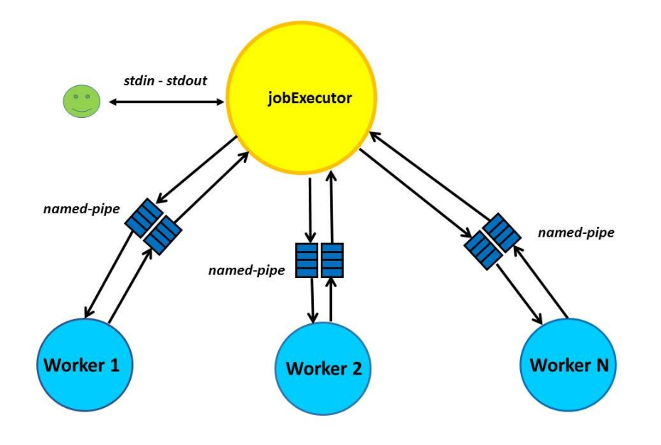

# JobExecutor
<p align="center">
  
</p>
<br />Implementation of a parallel query answering system, consisting of processes communicating through Pipes and Signals. A Master Process (JobExecutor) at first reads a file given which contains paths to folders containing files with articles. Then creates a number of Child Processes (Workers) and splits the files to paths to them using pipes. The synchronization between all the processes is achieved using signals. The Workers use the Trie implemented [here](https://github.com/AndCharalampous/minisearch) to create an index for the articles' words. After succesfull creation of Workers and their indexes, the JobExecutor can accept queries to answer.

## Deployment

The code was developed and tested on **Linux Ubuntu 16.04 LTS** using **gcc v5.4.0**.

## Prerequisites

A Linux distribution is required with a gcc compiler order to compile and execute. _gcc v5.4.0_ or older is recommended.
<br />You can check your gcc compiler version using:
<br />``` $ gcc --version ```

You can install the latest gcc compiler on Ubuntu based systems using:
<br />``` $ sudo apt install build-essential ``` 

## Getting Started
Download Repository Locally using:
<br /> ```$ git clone https://github.com/AndCharalampous/jobexecutor.git ```

## Compilation
Compile code guiding in src directory and using the Makefile:
<br /> ```$ cd src```
<br /> ```$ make```
<br /> Executable file jobExecutor is created.

### Execution
Execute using:
<br /> ```$ ./jobExecutor -d DocName -w W```
<br />DocName: Name of file containing paths to files
<br />W: Number of Workers

### Queries
* /search q1 q2 q3 ... qN –d deadline
<br />The JobExecutor sends the q strings to the Workers. Each worker searches it's index, finds the articles containing the given strings and returns their path and lines containing the strings. Workers must send results before the deadline specified (in seconds) or sends nothing. The JobExecutor informs the user how many users answered.  
* /maxcount keyword
<br />The jobExecutor sends the keyword to Workers. Each worker finds the articles with the most occurences and then sends the article's path with the number of occurences. Then the JobExecutor compares the occurences of each article and prints the path of the one with the most occurences.
* /mincount keyword
<br />Same as /maxcount, finding the file with the minimum occurences.
* /wc
<br /> Prints the total number of bytes, words and lines from all files. All Workers sends their stats of their files and the JobExecutor sums them up.
* /exit
<br />Exits application.

## Author

**Andreas Charalampous** - https://github.com/AndCharalampous

## License

This project is licensed under the MIT License - see the [LICENSE.md](LICENSE.md) file for details
